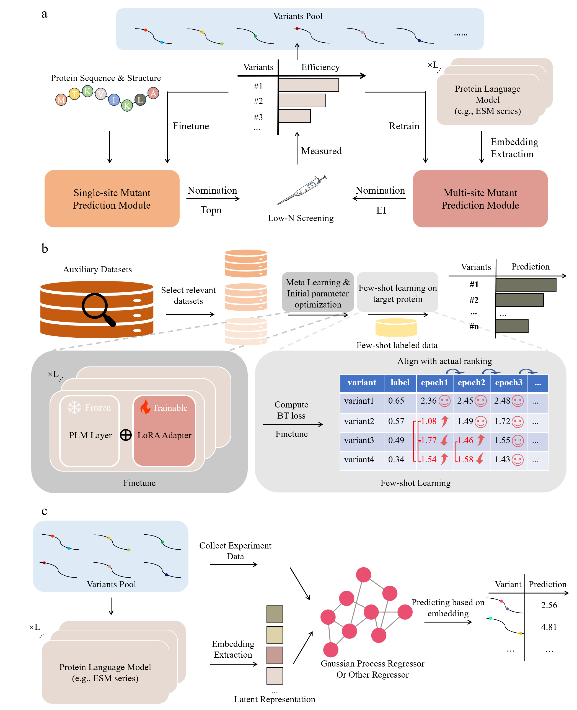

# ISDE: In Silico Directed Evolution for Protein Optimization

Official implementation of the ISDE framework for efficient protein mutation engineering under few-shot learning and active learning settings.

<p align="center">
  
</p>
---

## Overview

Protein engineering is often limited by the high experimental cost of generating labeled mutation data. To address this challenge, we propose **ISDE**, a unified framework that integrates:

* Few-shot protein fitness prediction
* Pairwise sample construction using Bradley–Terry loss
* Active learning-guided mutation exploration
* Single-site mutant prediction
* Multi-site mutant prediction

ISDE combines large protein language models (PLMs), active learning, and probabilistic modeling to efficiently identify high-fitness protein variants from limited experimental measurements.

The framework was validated on:

* ProteinGym benchmark datasets
* EVOLVEpro active learning benchmark
* Experimental engineering of RsCas12f1 CRISPR nuclease

---

## Framework

The ISDE framework consists of three major components:

### Finetune-based FSL Module

* ESM2
* SaProt
* FSFP meta-learning
* Bradley–Terry pairwise ranking loss (BTLoss)

Used for efficient single-site mutation fitness prediction under few-shot settings.

### Top Model-based FSL Module

* Gaussian Process Regression
* Kermut+
* SVM
* Random Forest
* Gradient Boosting Tree

Used for active learning and multi-site mutation modeling.

### Active Learning Module

Supports multiple acquisition functions:

* Greedy Search (Top-K)
* Expected Improvement (EI)
* Upper Confidence Bound (UCB)
* Thompson Sampling (TS)

---

## Repository Structure

```text
ISDE/
│
├── README.md
├── LICENSE
│
├── finetune-based_FSL/
│   ├── data/
│   ├── exp/
│   └── ...
│
├── top_model-based_FSL/
│   ├── data/
│   ├── gp/
│   └── ...
```

---

## Installation

### Clone Repository

```bash
git clone https://github.com/Melonoyk/ISDE.git
cd ISDE
```

### Create Environment & Install Dependencies

```bash
conda create -n isde-finetune
conda activate isde-finetune
conda install -r finetune-based_FSL/requirements.txt
conda create -n isde-top_model 
conda activate isde-top_model 
conda install -r top_model-based_FSL/requirements.txt
```

---

## External Dependencies

ISDE relies on several external tools and pretrained models.

#### ProteinMPNN

Used for extracting structure-conditioned residue probabilities.

https://github.com/dauparas/ProteinMPNN

#### SaProt

Used as a structure-aware protein language model.

https://github.com/westlake-repl/SaProt

#### GEMME

Used for zero-shot evolutionary fitness estimation.

http://www.lcqb.upmc.fr/GEMME

#### EVOLVEpro

Used for active learning benchmark datasets and workflows.

https://github.com/FordyceLab/EVOLVEpro

#### VenusFSFP

Used as the foundation of the few-shot protein prediction framework.

https://github.com/ai4protein/VenusFSFP

---

# Reproducing Experiments

## Chapter 1–2: Few-shot Learning Benchmark

Evaluate finetune-based and top model-based methods on ProteinGym datasets.

### Finetune-based Baselines

See:

```text
finetune-based_FSL/README.md
```

### Top Model-based Baselines

See:

```text
top_model-based_FSL/README.md
```

---

## Chapter 3: Active Learning Benchmark

Evaluate mutation discovery performance on 12 DMS datasets from EVOLVEpro.

Supported acquisition functions:

* Top-K
* EI
* UCB
* Thompson Sampling

---

## Chapter 5: ISDE Framework

### Single-site Mutant Prediction

Implemented in:

```text
finetune-based_FSL/directed_evolution_experimental.py
```

### Multi-site Mutant Prediction

Implemented in:

```text
top_model-based_FSL/gp/directed_evo_exp.py
```

---

## Datasets

### ProteinGym

The ProteinGym benchmark contains deep mutational scanning datasets covering:

* Enzymatic activity
* Binding affinity
* Expression
* Stability
* Organismal fitness

ProteinGym:

https://github.com/OATML-Markslab/ProteinGym

### EVOLVEpro

Active learning benchmark containing 12 experimentally validated DMS datasets.

---

## Acknowledgements

We thank the developers of:

* ProteinGym
* ProteinMPNN
* SaProt
* GEMME
* EVOLVEpro
* VenusFSFP

for making their tools and datasets publicly available.

